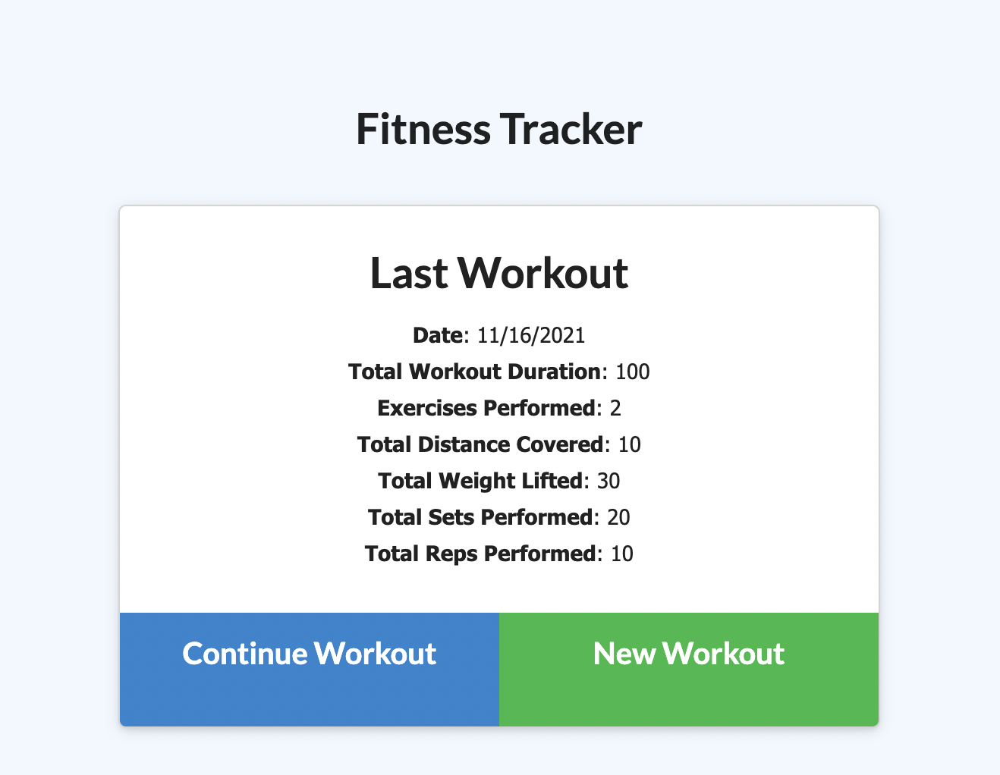

# Fitness Tracker 
## About
This website allows you to track your workout progress and put that data into a `MongoDB` database, so you can track your progress over the past week and see what you've done most recently.

## Description

On page load, you are shown a screen that displays your last workout with information about it, including date, total duration, etc. 

When you click on 

## Table of Contents
* [Installation](#installation)
* [Usage](#usage)
* [Contributing](#contributing)
* [Tests](#tests)
* [License](#license)
* [Questions](#questions)

## Installation
Run `npm i` to install `mongoose`, `express`, and `morgan`.

## Usage

## Contributing

## Tests

## License
This project is licensed under MIT.

## Questions
Here is a link to my [GitHub](https://github.com/kelliekumasaka) or shoot me an [email](mailto:kelliek3@gmail.com).