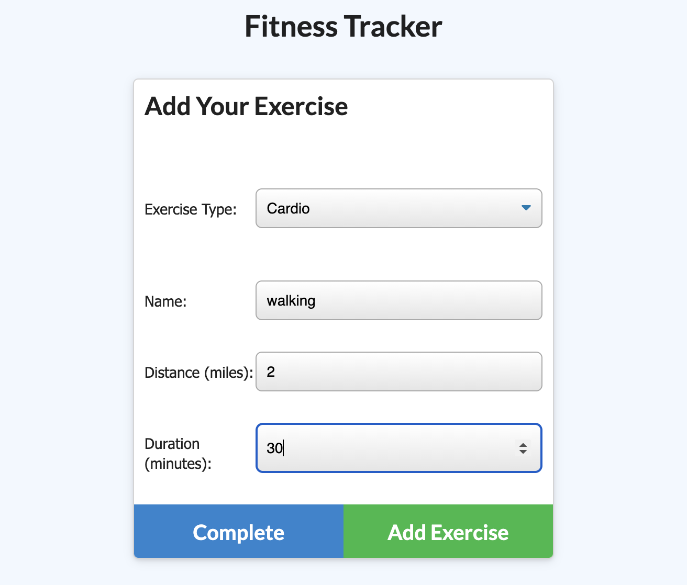
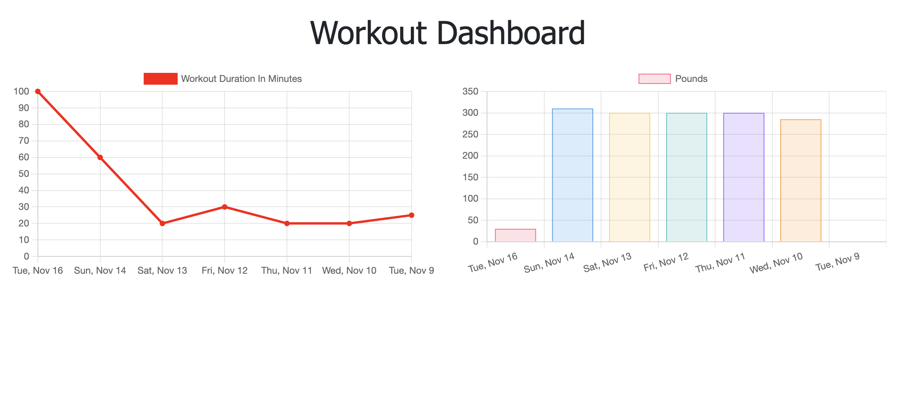

# Fitness Tracker 
## About
This website allows you to track your workout progress and put that data into a `MongoDB` database, so you can track your progress over the past week and see what you've done most recently.

## Description

On page load, you are shown a screen that displays your last workout with information about it, including date, total duration, etc. 

When you want to add a new workout or continue a workout, you are shown this page that will allow you to add one or more exercises to the workout. Depending on whether you choose `Resistance` or `Cardio`, the inputs will be different. 

After clicking `Complete` or `Add Exercise`, then there is a success alert that triggers and, if you clicked on `Complete` then you will be redirected to the fitness tracker home page, with your new workout information.

If you click on the dashboard link at the top, you are taken to a page with graphs that track how many pounds you have lifted for your resistance workouts and a line graph tracking the length of time that you've exercised over the past week.

## Table of Contents
* [Deployment](#deployment)
* [Installation](#installation)
* [Usage](#usage)
* [Contributing](#contributing)
* [Tests](#tests)
* [License](#license)
* [Questions](#questions)

## Deployment
Check out the app on Heroku here:

    https://kelliekumasaka-fitness-tracker.herokuapp.com/

## Installation
Run `npm i` to install `mongoose`, `express`, and `morgan`.

## Usage

## Contributing

## Tests

## License
This project is licensed under MIT.

## Questions
Here is a link to my [GitHub](https://github.com/kelliekumasaka) or shoot me an [email](mailto:kelliek3@gmail.com).